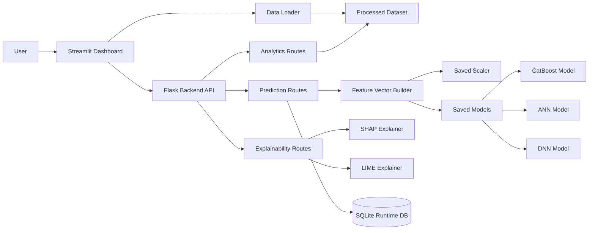
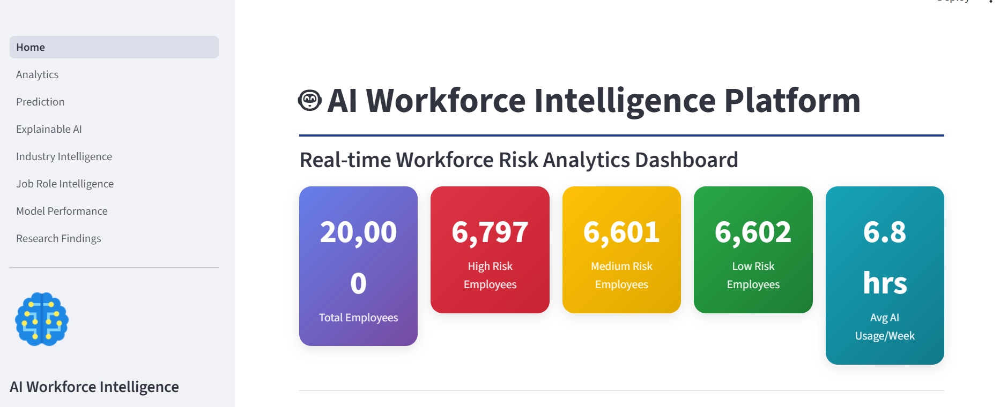
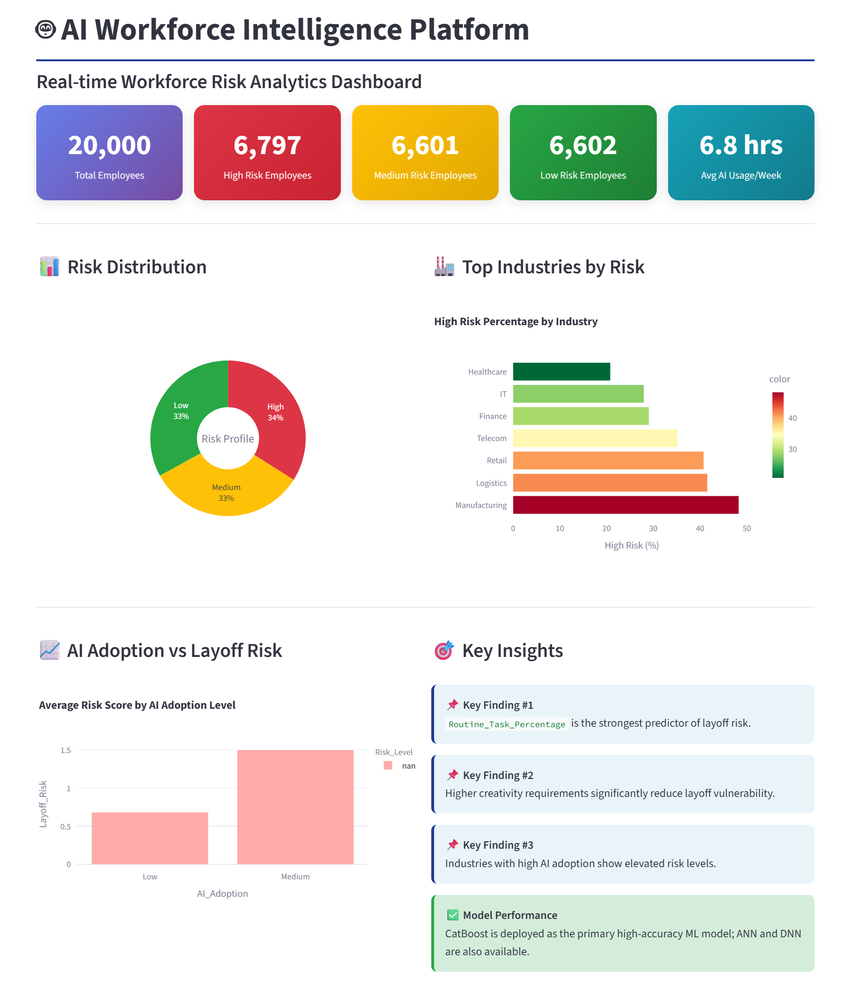
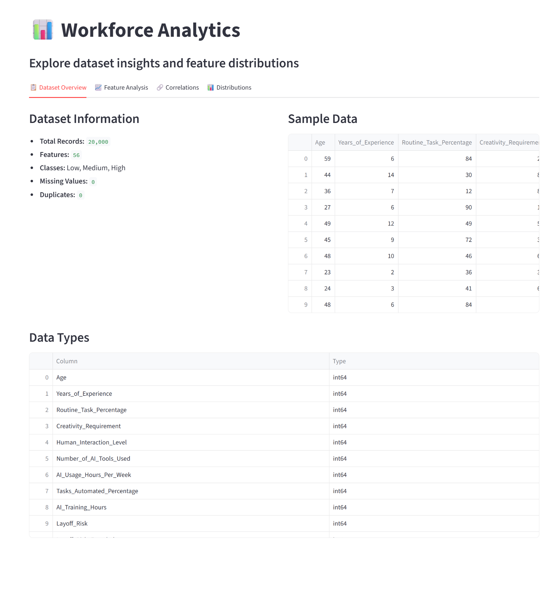
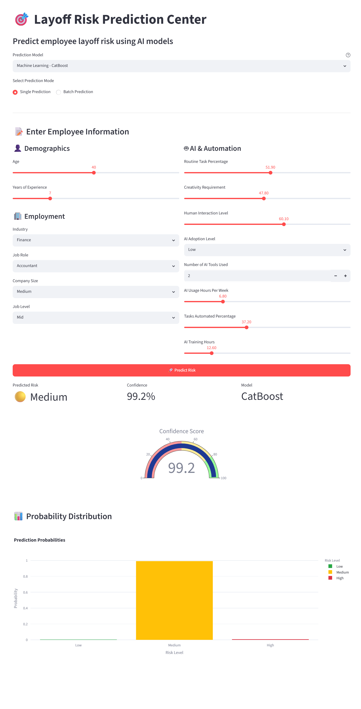
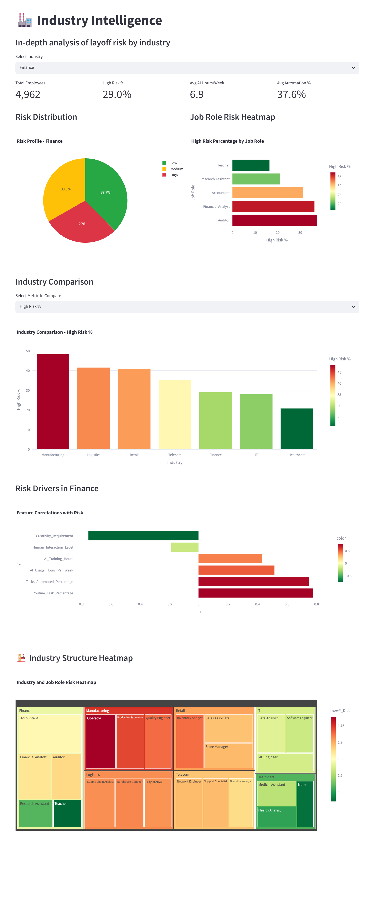
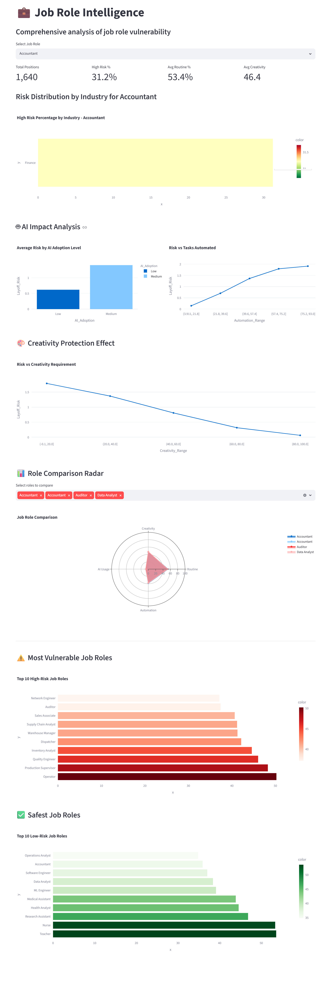
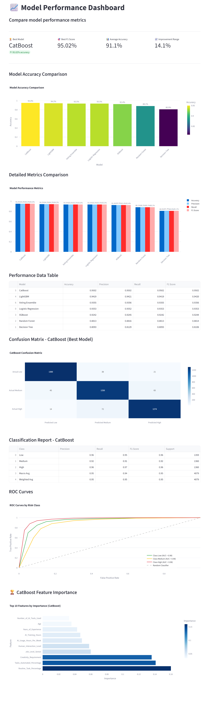
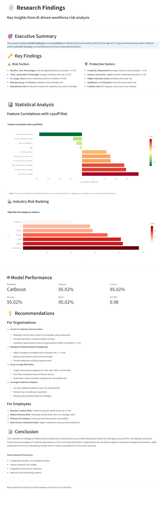

# 🤖 AI-Driven Employee Layoff Risk Prediction

An end-to-end workforce intelligence platform that predicts employee layoff risk using machine learning and deep learning models. The system combines a Flask prediction API, a Streamlit analytics dashboard, saved model artifacts, explainability tools, and a processed workforce dataset.

The project is designed to help analyze how role characteristics, automation exposure, AI adoption, creativity requirements, and industry context relate to workforce displacement risk.

---

## 📌 Table Of Contents

- [Overview](#-overview)
- [Key Features](#-key-features)
- [Tech Stack](#-tech-stack)
- [Project Structure](#-project-structure)
- [Architecture](#-architecture)
- [Dataset](#-dataset)
- [Model Artifacts](#-model-artifacts)
- [Backend API](#-backend-api)
- [Dashboard Pages](#-dashboard-pages)
- [Screenshots](#-screenshots)
- [Setup Instructions](#-setup-instructions)
- [Run The Application](#-run-the-application)
- [Dependencies and Runtime](#dependencies-and-runtime)
- [API Examples](#-api-examples)
- [Troubleshooting](#-troubleshooting)
- [Future Improvements](#-future-improvements)

---

## 🧭 Overview

The platform classifies employees into three layoff-risk levels:

- **Low**
- **Medium**
- **High**

Predictions are based on workforce attributes such as age, experience, industry, job role, company size, job level, AI adoption, automation percentage, routine-task percentage, creativity requirement, and AI training exposure.

The application includes:

- A **Flask backend** for prediction, analytics, database logging, and explainability endpoints
- A **Streamlit dashboard** for visual analysis and user interaction
- A **CatBoost model** as the primary machine learning model
- **ANN and DNN models** for deep-learning-based predictions
- **SHAP and LIME explainability** support
- A processed dataset used across dashboard analytics pages

---

## ✨ Key Features

- Single employee layoff-risk prediction
- Batch CSV prediction workflow
- CatBoost, ANN, and DNN model selection
- Risk probability breakdown for Low, Medium, and High classes
- Workforce analytics dashboard with KPI cards and charts
- Industry-level risk analysis
- Job-role intelligence analysis
- Model performance dashboard
- SHAP and LIME explanation endpoints
- SQLite prediction and query logging
- Health-check endpoint for backend status

---

## 🛠️ Tech Stack

| Layer | Tools |
| --- | --- |
| Backend | Flask, Flask-CORS |
| Dashboard | Streamlit |
| Data Processing | Pandas, NumPy |
| Machine Learning | CatBoost, scikit-learn, TensorFlow/Keras |
| Explainability | SHAP, LIME |
| Visualization | Plotly |
| Persistence | SQLite |
| Model Storage | Pickle, Keras model files |

---

## 📁 Project Structure

```text
AI-Layoff-Risk-System/
  backend/
    app.py
    config.py
    database.py
    explainability.py
    models/
      ml_model.pkl
      catboost_model.pkl
      ann_layoff_model.keras
      dnn_layoff_model.keras
      scaler.pkl
    routes/
      analytics.py
      explain.py
      predict.py
  dashboard/
    Home.py
    assets/
      logo.png
      style.css
    pages/
      01_Analytics.py
      02_Prediction.py
      03_Explainable_AI.py
      04_Industry_Intelligence.py
      05_Job_Role_Intelligence.py
      06_Model_Performance.py
      07_Research_Findings.py
    utils/
      data_loader.py
  data/
    processed_layoff_dataset.csv
  requirements.txt
  README.md
```

---

## 🏗️ Architecture



### 🔄 Application Flow

1. The user opens the Streamlit dashboard.
2. Dashboard pages load the processed dataset for visual analytics.
3. Prediction inputs are sent to the Flask backend.
4. The backend builds the exact trained feature vector.
5. The selected model returns a class prediction and probability scores.
6. Prediction metadata is stored in the local SQLite database.
7. SHAP or LIME endpoints can explain model behavior for a selected record.

---

## 📊 Dataset

Main dataset path:

```text
data/processed_layoff_dataset.csv
```

The dataset contains encoded workforce and AI-adoption features used by the dashboard and backend analytics routes.

Important feature groups:

- Demographics: `Age`, `Years_of_Experience`
- Work profile: `Industry`, `Job_Role`, `Company_Size`, `Job_Level`
- AI exposure: `AI_Adoption`, `Number_of_AI_Tools_Used`, `AI_Usage_Hours_Per_Week`
- Automation indicators: `Routine_Task_Percentage`, `Tasks_Automated_Percentage`
- Human-centered work indicators: `Creativity_Requirement`, `Human_Interaction_Level`
- Target: `Layoff_Risk`

Risk classes:

```text
0 = Low
1 = Medium
2 = High
```

---

## 🧠 Model Artifacts

Required model files are stored in:

```text
backend/models/
```

| File | Purpose |
| --- | --- |
| `ml_model.pkl` | Primary saved machine-learning model |
| `catboost_model.pkl` | CatBoost-compatible model artifact |
| `ann_layoff_model.keras` | Artificial Neural Network model |
| `dnn_layoff_model.keras` | Deep Neural Network model |
| `scaler.pkl` | Feature scaler used for ANN/DNN inputs |

The backend reports model availability through:

```text
GET /health
```

---

## 🔌 Backend API

The Flask backend is located in:

```text
backend/
```

Default API URL:

```text
http://127.0.0.1:5000
```

### 🩺 Health

| Method | Endpoint | Description |
| --- | --- | --- |
| GET | `/health` | Checks backend and model loading status |

### 🎯 Prediction

| Method | Endpoint | Description |
| --- | --- | --- |
| POST | `/predict` | Predicts risk for one employee |
| POST | `/predict/batch` | Predicts risk for multiple records |

### 📈 Analytics

| Method | Endpoint | Description |
| --- | --- | --- |
| GET | `/analytics/summary` | Dataset summary and top correlations |
| GET | `/analytics/industry/<industry>` | Industry-specific analysis |
| GET | `/analytics/job/<job_role>` | Job-role-specific analysis |
| GET | `/analytics/correlations` | Feature correlations with layoff risk |

### 🔍 Explainability

| Method | Endpoint | Description |
| --- | --- | --- |
| POST | `/explain/shap` | Local SHAP contribution analysis |
| POST | `/explain/lime` | Local LIME explanation |
| POST | `/explain/shap/summary` | Global SHAP-style feature importance |

---

## 🖥️ Dashboard Pages

The Streamlit dashboard is located in:

```text
dashboard/
```

| Page | Purpose |
| --- | --- |
| `Home.py` | Main KPI overview, risk distribution, industry risk, and key insights |
| `01_Analytics.py` | Dataset overview, feature analysis, correlations, and distributions |
| `02_Prediction.py` | Single and batch prediction workflows |
| `03_Explainable_AI.py` | SHAP and LIME explanation views |
| `04_Industry_Intelligence.py` | Industry-level risk analysis |
| `05_Job_Role_Intelligence.py` | Job-role-level risk analysis |
| `06_Model_Performance.py` | Model comparison, metrics, confusion matrix, ROC curves, and feature importance |
| `07_Research_Findings.py` | Research summary, statistical findings, and recommendations |

---

## 🖼️ Screenshots











## ⚙️ Setup Instructions

Run the following commands from the project folder:

```powershell
cd AI-Layoff-Risk-System
python -m venv .venv
.\.venv\Scripts\Activate.ps1
pip install -r requirements.txt
```

Confirm the model files exist:

```powershell
Get-ChildItem backend\models
```

Confirm the dataset exists:

```powershell
Get-ChildItem data\processed_layoff_dataset.csv
```

---

## 🚀 Run The Application

### 1. Start The Backend

Open a terminal:

```powershell
cd AI-Layoff-Risk-System\backend
python app.py
```

Backend URL:

```text
http://127.0.0.1:5000
```

Check health:

```powershell
Invoke-RestMethod -Uri http://127.0.0.1:5000/health
```

### 2. Start The Dashboard

Open a second terminal:

```powershell
cd AI-Layoff-Risk-System
streamlit run dashboard/Home.py
```

If the API runs on a different URL:

```powershell
$env:API_URL="http://127.0.0.1:5000"
streamlit run dashboard/Home.py
```

> For Streamlit Cloud, the app entrypoint is `dashboard/Home.py`, and the repository root must include `requirements.txt` and `runtime.txt`.

---

## 🧪 API Examples

### 🩺 Health Check

```powershell
Invoke-RestMethod -Uri http://127.0.0.1:5000/health
```

### 🎯 Single Prediction

```powershell
$payload = @{
  model_type = "ml"
  Age = 35
  Years_of_Experience = 10
  Routine_Task_Percentage = 60
  Creativity_Requirement = 40
  Human_Interaction_Level = 50
  Number_of_AI_Tools_Used = 2
  AI_Usage_Hours_Per_Week = 8
  Tasks_Automated_Percentage = 45
  AI_Training_Hours = 12
  Education_Level = "Bachelor's"
  Industry = "IT"
  Job_Role = "Software Engineer"
  Company_Size = "Medium"
  Job_Level = "Mid"
  AI_Adoption = "Medium"
} | ConvertTo-Json

Invoke-RestMethod `
  -Uri http://127.0.0.1:5000/predict `
  -Method Post `
  -Body $payload `
  -ContentType "application/json"
```

Expected response fields:

```text
success
prediction
risk_level
confidence
probabilities
model_type
model_name
prediction_id
```

---

## 🧯 Troubleshooting

### Backend Already Running

If `python app.py` says the backend is already running, check the port:

```powershell
netstat -ano | findstr :5000
```

Stop a process by PID:

```powershell
Stop-Process -Id <PID>
```

### TensorFlow GPU Warning On Windows

TensorFlow may print a native Windows GPU warning. The application can still run on CPU.

### Dashboard Cannot Connect To API

Confirm the backend is running:

```powershell
Invoke-RestMethod -Uri http://127.0.0.1:5000/health
```

Then restart Streamlit:

```powershell
streamlit run dashboard/Home.py
```

### Missing Model Files

The backend health endpoint will show degraded status if model files are missing. Place all required artifacts in:

```text
backend/models/
```

---

## 🧹 Repository Hygiene

The repository ignores runtime and temporary files such as:

- Python cache folders
- SQLite runtime databases
- virtual environments
- training-output folders
- root-level notebook experiments
- duplicate root-level model artifacts

The application source, processed dataset, dashboard assets, and backend model artifacts are kept inside the main project folder.

---

## 🔮 Future Improvements

- Add authentication for dashboard and API access
- Add automated test coverage for API routes
- Add model retraining scripts
- Add real screenshots under `docs/screenshots/`
- Add Docker support for easier deployment
- Add production WSGI configuration
- Add model versioning and experiment tracking

---

## 📄 License

This project is prepared for academic and portfolio use. Add a license file before public distribution if required.
